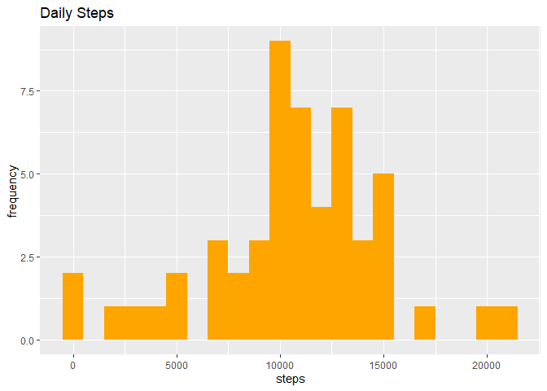
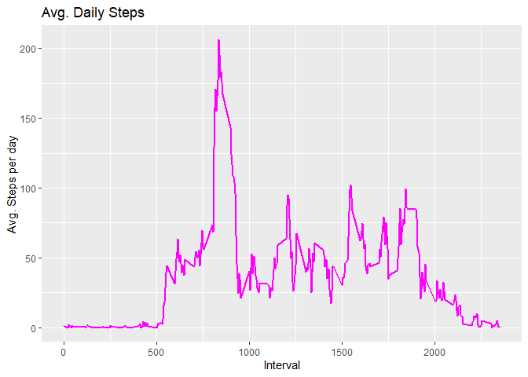
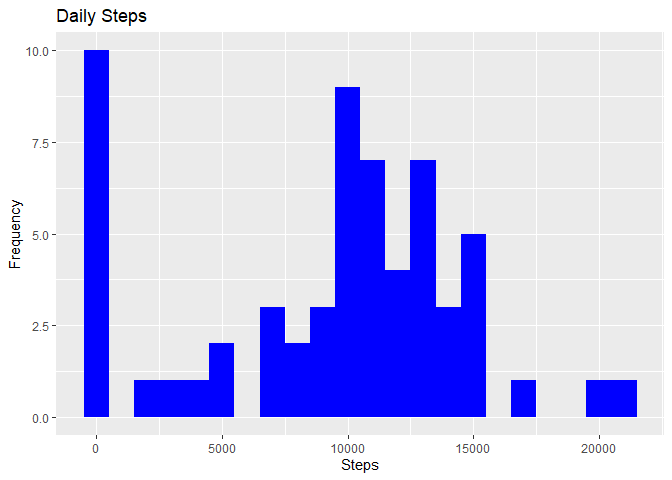
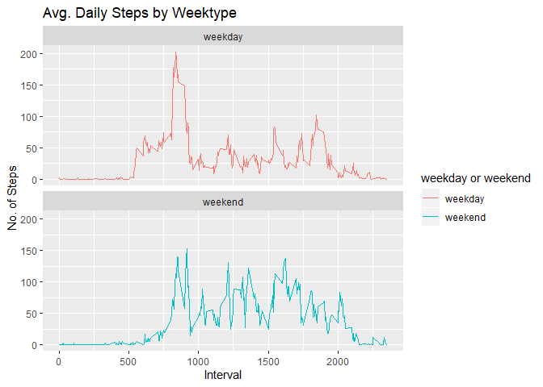

Loading the data
----------------

    library("data.table")
    library(ggplot2)

    activityDT <- data.table::fread(input = "activity.csv")

What is mean total number of steps taken per day?
-------------------------------------------------

    total_steps <- activityDT[, c(lapply(.SD, sum, na.rm = FALSE)), .SDcols = c("steps"), by = .(date)]

    pl <- ggplot(total_steps, aes(x=steps)) + geom_histogram(fill="orange", binwidth = 1000) +
            labs(title="Daily Steps", y = "frequency")
    print(pl)

    ## Warning: Removed 8 rows containing non-finite values (stat_bin).

#### Mean and median of the total number of steps taken per day

    total_steps[, .(Mean_Steps = mean(steps, na.rm = TRUE), Median_Steps = median(steps, na.rm = TRUE))]

    ##    Mean_Steps Median_Steps
    ## 1:   10766.19        10765

What is the average daily activity pattern?
-------------------------------------------

    IntervalDT <- activityDT[, c(lapply(.SD, mean, na.rm = TRUE)), .SDcols = c("steps"), by = .(interval)] 

    pl<-ggplot(IntervalDT, aes(x = interval , y = steps)) + geom_line(color="magenta", size=1) + 
            labs(title = "Avg. Daily Steps", x = "Interval", y = "Avg. Steps per day")
    print(pl)

#### Which 5-minute interval, on average across all the days in the dataset, contains the maximum number of steps?

    IntervalDT[steps == max(steps), .(max_interval = interval)]

    ##    max_interval
    ## 1:          835

Imputing missing values
-----------------------

#### Number of missing values in the dataset

    activityDT[is.na(steps), .N ]

    ## [1] 2304

#### Filling in missing values with median

    activityDT[is.na(steps), "steps"] <- activityDT[, c(lapply(.SD, median, na.rm = TRUE)), .SDcols = c("steps")]

#### Create a new dataset that is equal to the original dataset but with the missing data filled in

    data.table::fwrite(x = activityDT, file = "activity_filled.csv", quote = FALSE)

#### Make a histogram of the total number of steps taken each day and Calculate and report the mean and median total number of steps taken per day.

    Total_Steps <- activityDT[, c(lapply(.SD, sum)), .SDcols = c("steps"), by = .(date)] 
    Total_Steps[, .(Mean_Steps = mean(steps), Median_Steps = median(steps))]

    ##    Mean_Steps Median_Steps
    ## 1:    9354.23        10395

    pl <- ggplot(Total_Steps, aes(x = steps)) + geom_histogram(fill = "blue", binwidth = 1000) + 
            labs(title = "Daily Steps", x = "Steps", y = "Frequency")
    print(pl)

Are there differences in activity patterns between weekdays and weekends?
-------------------------------------------------------------------------

#### Create a new factor variable in the dataset with two levels – “weekday” and “weekend” indicating whether a given date is a weekday or weekend day.

    activityDT <- data.table::fread(input = "activity.csv")
    activityDT[, date := as.POSIXct(date, format = "%Y-%m-%d")]
    activityDT[, `Day of Week`:= weekdays(x = date)]
    activityDT[grepl(pattern = "Monday|Tuesday|Wednesday|Thursday|Friday", x = `Day of Week`), "weekday or weekend"] <- "weekday"
    activityDT[grepl(pattern = "Saturday|Sunday", x = `Day of Week`), "weekday or weekend"] <- "weekend"
    activityDT[, `weekday or weekend` := as.factor(`weekday or weekend`)]
    head(activityDT, 10)

    ##     steps       date interval Day of Week weekday or weekend
    ##  1:    NA 2012-10-01        0      Monday            weekday
    ##  2:    NA 2012-10-01        5      Monday            weekday
    ##  3:    NA 2012-10-01       10      Monday            weekday
    ##  4:    NA 2012-10-01       15      Monday            weekday
    ##  5:    NA 2012-10-01       20      Monday            weekday
    ##  6:    NA 2012-10-01       25      Monday            weekday
    ##  7:    NA 2012-10-01       30      Monday            weekday
    ##  8:    NA 2012-10-01       35      Monday            weekday
    ##  9:    NA 2012-10-01       40      Monday            weekday
    ## 10:    NA 2012-10-01       45      Monday            weekday

#### Make a panel plot containing a time series plot (i.e. type=“l”) of the 5-minute interval (x-axis) and the average number of steps taken, averaged across all weekday days or weekend days (y-axis)

    activityDT[is.na(steps), "steps"] <- activityDT[, c(lapply(.SD, median, na.rm = TRUE)), .SDcols = c("steps")]
    IntervalDT <- activityDT[, c(lapply(.SD, mean, na.rm = TRUE)), .SDcols = c("steps"), by = .(interval, `weekday or weekend`)] 

    pl<-ggplot(IntervalDT , aes(x = interval , y = steps, color=`weekday or weekend`)) + 
            geom_line() + labs(title = "Avg. Daily Steps by Weektype", x = "Interval", y = "No. of Steps") + 
            facet_wrap(~`weekday or weekend` , ncol = 1, nrow=2)
    print(pl)

